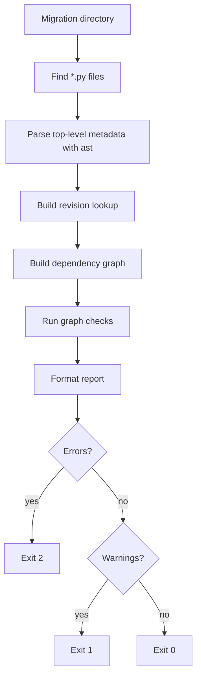
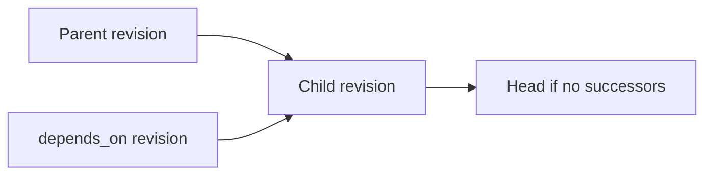

# Alembic migration checker

Dependency-free Alembic migration graph checker for pre-commit hooks and CI/CD
pipelines.

The tool validates migration metadata without importing Alembic, connecting to a
database, or executing migration code. It statically parses Python migration
files with the standard-library `ast` module and checks whether the resulting
revision graph is structurally safe.

## Purpose

Use this script when you need a lightweight gate that catches migration-chain
problems before `alembic upgrade head` reaches CI, deploy, or production.

Benefits:

- No third-party Python dependencies.
- No database required.
- No Alembic runtime import required.
- Suitable for local pre-commit hooks and CI jobs.
- Fails fast on common dependency graph errors.

Trade-offs:

- It validates revision graph structure only, not SQL, schema state, or
  `upgrade()` / `downgrade()` behavior.
- It only understands statically assigned Alembic metadata.
- Files with syntax or read errors are skipped with a `SKIP` message on stderr,
  not reported as checker errors.

## Requirements

- Python 3.9 or newer.
- Alembic migration files using standard top-level metadata assignments:

```python
revision = "202604160001"
down_revision = "202604150001"
branch_labels = None
depends_on = None
```

Supported metadata values are:

- `str`
- `None`
- tuple of strings, for example `("rev_a", "rev_b")`

## Usage

```bash
python check_migrations.py alembic/versions
```

Full CLI:

```bash
python check_migrations.py \
  alembic/versions \
  --branch-mode error \
  --merge-mode error \
  --ordering-mode off
```

Options:

| Option | Values | Default | Meaning |
| --- | --- | --- | --- |
| `migrations_dir` | path | required | Directory containing Alembic version files. |
| `--branch-mode` | `warn`, `error` | `error` | Severity for migrations that fork from the same parent. |
| `--merge-mode` | `warn`, `error` | `error` | Severity for merge migrations with multiple `down_revision` parents. |
| `--ordering-mode` | `off`, `warn`, `error` | `off` | Checks whether child filenames sort after parent filenames. |

Exit codes:

| Code | Meaning |
| --- | --- |
| `0` | No issues found. |
| `1` | Warnings found, but no errors. |
| `2` | At least one error, invalid migrations directory, or another fatal checker error. |

Important: `warn` still exits with code `1`. That fails most pre-commit and CI
steps unless you explicitly allow that exit code.

If the directory exists but no migration files are loaded, the script prints
`No migration files found.` and exits `0`.

## What It Checks

The checker loads every `*.py` file in the migration directory, excluding files
whose names start with `__`. A file is treated as a migration only when it has a
statically parseable top-level string `revision`.

Checks performed:

| Check | Severity | Description |
| --- | --- | --- |
| `duplicate_revision` | error | Two files define the same `revision`. |
| `missing_dependency` | error | `down_revision` or `depends_on` references an unknown revision. |
| `circular_dependency` | error | The graph contains a dependency cycle. |
| `divergent_heads` | error | More than one head revision exists. |
| `branching` | configurable | One revision has multiple successors. |
| `merge_migration` | configurable | A migration has multiple `down_revision` parents. |
| `orphan` | error | A migration is unreachable from any base revision. |
| `file_ordering` | configurable | A child migration filename sorts before or equal to its parent filename. |

`depends_on` is treated as an additional dependency edge during graph analysis.
`branch_labels` is parsed but not currently used by any check.

## Architecture



Dependency model:



## Example Output

```text
=== Migration Check Report ===

Summary:
  Total migrations: 3
  Base(s): 001 (001_create_users.py)
  Head(s): 003 (003_add_email.py)

Issues: (0 error(s), 0 warning(s))

  No issues found. Migration chain is clean.

Result: PASS
```

## Pre-commit

This repository publishes one pre-commit hook in
`.pre-commit-hooks.yaml`:

```yaml
- id: check-alembic-migrations
  entry: check_migrations.py
  language: script
```

Install it from the repository and set behavior with `args` in your own
`.pre-commit-config.yaml`.

Basic usage:

```yaml
repos:
  - repo: https://github.com/l4sh/alembic-migration-checker
    rev: <tag-or-commit>
    hooks:
      - id: check-alembic-migrations
        args:
          - alembic/versions
```

Strict variant:

```yaml
repos:
  - repo: https://github.com/l4sh/alembic-migration-checker
    rev: <tag-or-commit>
    hooks:
      - id: check-alembic-migrations
        args:
          - alembic/versions
          - --branch-mode
          - error
          - --merge-mode
          - error
          - --ordering-mode
          - error
```

Lenient variant:

```yaml
repos:
  - repo: https://github.com/l4sh/alembic-migration-checker
    rev: <tag-or-commit>
    hooks:
      - id: check-alembic-migrations
        args:
          - alembic/versions
          - --branch-mode
          - warn
          - --merge-mode
          - warn
          - --ordering-mode
          - warn
```

Multiple levels in the same config:

```yaml
repos:
  - repo: https://github.com/l4sh/alembic-migration-checker
    rev: <tag-or-commit>
    hooks:
      - id: check-alembic-migrations
        name: Alembic migrations (default)
        args:
          - alembic/versions

      - id: check-alembic-migrations
        name: Alembic migrations (strict ordering)
        args:
          - alembic/versions
          - --ordering-mode
          - error
```

Severity matrix:

| Goal | Args |
| --- | --- |
| Default | `--branch-mode error --merge-mode error --ordering-mode off` |
| Strict | `--branch-mode error --merge-mode error --ordering-mode error` |
| Advisory | `--branch-mode warn --merge-mode warn --ordering-mode warn` |

Important: pre-commit treats any non-zero exit code as failure. That means
`warn` still blocks the commit because this script exits `1` when warnings are
present. The `warn` modes are useful when you want softer classification in the
report, not when you want pre-commit to pass.

## GitHub Actions

```yaml
name: migrations

on:
  pull_request:
  push:
    branches:
      - main

jobs:
  check-migrations:
    runs-on: ubuntu-latest
    steps:
      - uses: actions/checkout@v4
      - uses: actions/setup-python@v5
        with:
          python-version: "3.12"
      - name: Check Alembic migration graph
        run: python check_migrations.py alembic/versions
```

## GitLab CI

```yaml
check_migrations:
  image: python:3.12-slim
  script:
    - python check_migrations.py alembic/versions
```

## Limitations

This checker does not:

- Import or execute migration files.
- Validate `upgrade()` or `downgrade()` logic.
- Validate generated SQL.
- Compare migrations against a live database.
- Interpret dynamically computed revision metadata.
- Treat syntax-invalid migration files as hard failures.

For semantic validation, run this checker alongside normal Alembic commands and
project tests.

## License

MIT. See [LICENSE](LICENSE).
